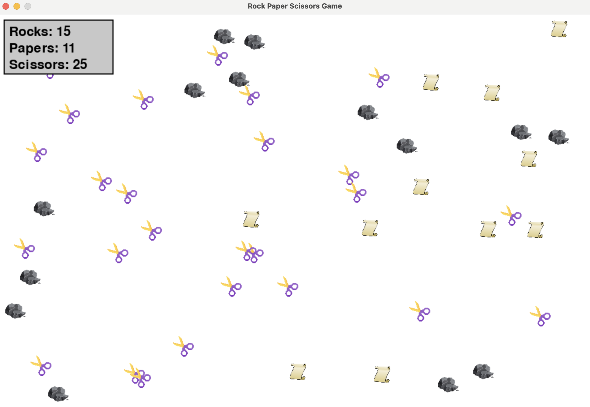

# A Rock Paper Scissors Simulator

This project is implemented using ``pygame``. We have successfully developed a function that determines the 
next moment velocity of each object, assuming an elastic collision. This renders an animation that provides 
a fast and streamlined experience. 

Physical principles claim that two objects with weights $m_1, m_2$ and initial velocities $v_1, v_2$ will
end up with the speed of 

$$v_1'=\frac{2m_1}{m_1+m_2}v_1-\frac{m_1-m_2}{m_1+m_2}v_2, \frac{2m_2}{m_1+m_2}v_2+\frac{m_1-m_2}{m_1+m_2}v_1.$$

The case is simpler in this scenario, as we assume each object has the unit weight $m=1$.

